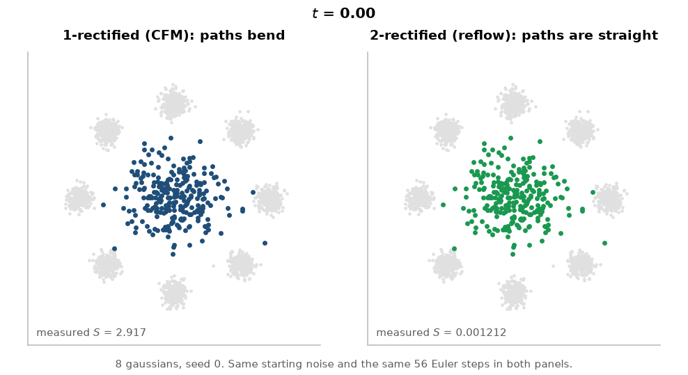
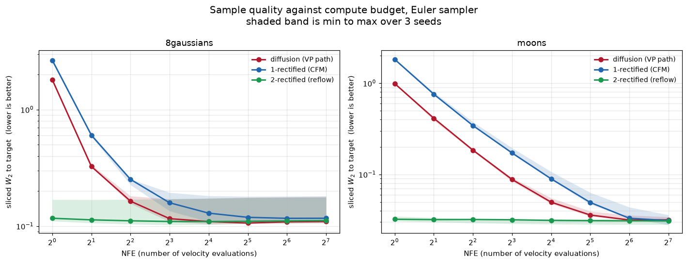
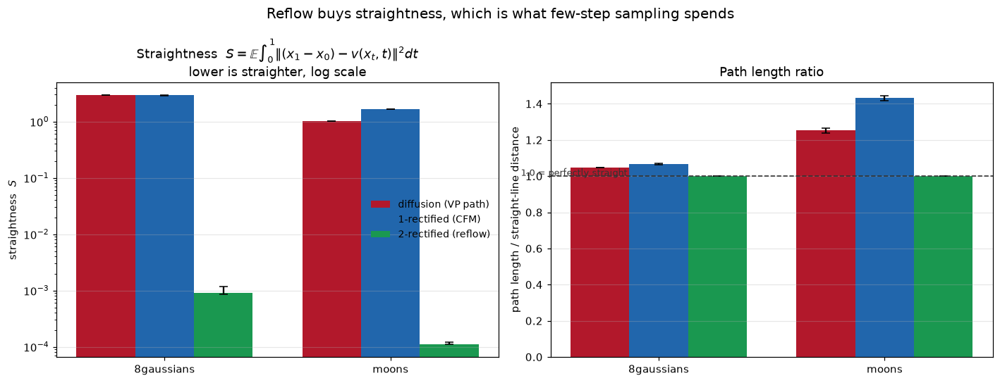
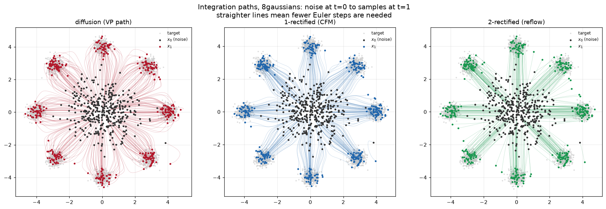
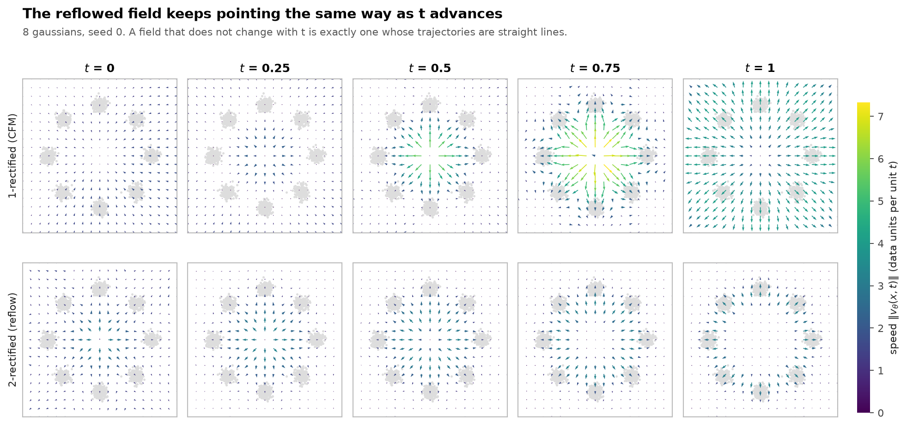
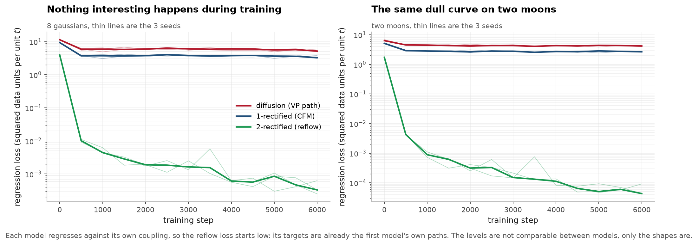

# rectified-flow-from-scratch

[](https://github.com/aghasalim/rectified-flow-from-scratch/actions/workflows/ci.yml)
[](https://www.python.org/)
[](LICENSE)
[](results/)

Conditional flow matching, rectified flow, and reflow, built from the papers. The
straightness metric is measured rather than asserted, and it is the number that
explains everything else in here.

Everything below ran on a laptop CPU (Apple M4). Total compute for the whole
results table is about eight minutes.



*Each dot is one sample being carried from noise at t=0 to the target at t=1 by
integrating dx/dt = v(x,t). Left is a diffusion path, middle is plain flow
matching, right is after one round of reflow. Look at how the right panel moves
in straight lines while the other two curve.*

## The one result

All three models reach roughly the same sample quality if you give them enough
compute. Only the reflowed one still works when you give it a single step.

**8 gaussians**, sliced Wasserstein-2 to the target (lower is better), median of
3 seeds, Euler sampler:

| NFE | diffusion (VP) | 1-rectified (CFM) | 2-rectified (reflow) |
|---:|---:|---:|---:|
| 1 | 1.804 | 2.641 | **0.112** |
| 2 | 0.322 | 0.602 | **0.108** |
| 4 | 0.168 | 0.251 | **0.104** |
| 8 | 0.124 | 0.154 | **0.103** |
| 128 | 0.117 | 0.108 | 0.106 |

**two moons**, same protocol:

| NFE | diffusion (VP) | 1-rectified (CFM) | 2-rectified (reflow) |
|---:|---:|---:|---:|
| 1 | 0.980 | 1.835 | **0.034** |
| 2 | 0.403 | 0.776 | **0.033** |
| 4 | 0.181 | 0.346 | **0.032** |
| 8 | 0.089 | 0.175 | **0.032** |
| 128 | 0.031 | 0.031 | 0.031 |

The reflowed model at 1 NFE is as good as itself at 128 NFE. On moons that is a
128x reduction in sampling cost for no measurable loss, and the flat green line
below is what that looks like.



## Why it works, measured

The reason is straightness. If a trajectory is a straight line then one Euler
step integrates it exactly, because the velocity never changes along the path.
If it curves, one step cuts the corner and you land somewhere wrong.

The metric is

    S = E integral from 0 to 1 of || (x1 - x0) - v(x_t, t) ||^2 dt

where x1 is the endpoint the model's own ODE actually reaches, not an
independent data sample. S is zero exactly when every trajectory is straight.

| dataset | model | S | path length / straight line |
|---|---|---:|---:|
| 8gaussians | diffusion (VP) | 2.934 | 1.048 |
| 8gaussians | 1-rectified | 2.930 | 1.067 |
| 8gaussians | 2-rectified | **0.00091** | **1.00005** |
| moons | diffusion (VP) | 1.012 | 1.255 |
| moons | 1-rectified | 1.662 | 1.433 |
| moons | 2-rectified | **0.00011** | **1.00006** |

Reflow drops S by about 3200x on 8 gaussians and about 15000x on moons. The path
length ratio goes to 1.00005, which means the trajectories are straight to five
decimal places.



You can see the same thing without any metric at all, just by plotting the paths:



## What reflow actually does

Plain conditional flow matching draws x0 from noise and x1 from data
independently. Each individual pair gets a straight conditional path, and the
target velocity x1 - x0 is constant along it. That part is fine. The problem is
that paths belonging to different pairs cross, and at a crossing point the model
can only learn one velocity, so it learns the average of the two. Averaging two
different directions gives a direction that points somewhere neither path was
going, and the marginal trajectory bends.

Reflow fixes the coupling instead of the model. Integrate the trained model
accurately from many noise samples, keep the pairs (x0, x1) it produced, and
retrain on those. Because x0 to x1 is now a function, the paths cannot cross, so
there is nothing to average away and the straight conditional paths survive into
the marginal field.

This shows up directly in the learned velocity field. The reflowed field barely
changes with t, which is what straight means:



## The cost

Reflow is not free and the tables above show the price if you look at the last
row. At 128 NFE on 8 gaussians the reflowed model scores 0.106 against 0.108 for
the model it was distilled from, so quality is basically unchanged here, but the
reflowed model can never be better than its teacher because it is trained on its
teacher's outputs. Any error the first model made is baked into the coupling. On
a harder dataset that gap would be visible.

The honest summary is that reflow trades a ceiling for a floor. You give up the
chance of improving with more compute, and in exchange you get most of the
quality at one step.

## Training

The objective is a plain regression against the interpolant slope. No ELBO, no
score function, no noise schedule. The loss curves are dull, and that is the
point:



## What I got wrong

**The diffusion control ran backwards for a whole experiment.** I wrote `VPPath`
using the convention from the diffusion papers, where t=0 is data and t=1 is
noise, while `LinearPath` and every sampler in the repo use t=0 for noise. So the
model learned a field pointing from data to noise and then got integrated the
wrong way.

It did not crash and it did not produce NaNs. It produced a plausible looking
blob. What gave it away was that its sliced W2 got *worse* with more compute,
2.43 at one step against 2.84 at 128, which cannot happen if the ODE is oriented
correctly. I had a test asserting the VP path preserves variance and a test
asserting its velocity depends on t, and both passed the whole time. The test I
did not have was the obvious one, that t=0 is the noise end, and that is now
parametrised over every path class.

**My straightness metric returned exactly 0.0 on an untrained network and I
nearly "fixed" it.** An untrained MLP outputs a nearly constant field, and a
constant field really does give perfectly straight lines, so S=0 was correct. I
only convinced myself by writing a field that curves on purpose and checking S
went above zero. That negative test is in the suite now, because a metric that
can only return zero looks identical to one that is working.

## Running it

```bash
python -m venv .venv && source .venv/bin/activate
pip install -r requirements.txt
```

```bash
python -m pytest tests/ -q
```

```bash
python -m bench.experiment --datasets 8gaussians moons --seeds 0 1 2 --steps 6000
```

```bash
python -m bench.figures
```

The experiment takes about 8 minutes on an M4 CPU and writes `results/*.csv` plus
the model checkpoints. `bench.figures` reads those files and never re-runs an
experiment, so a figure cannot disagree with a number in this README.

## Layout

```
fm/paths.py         linear and VP interpolants, and their velocity targets
fm/models.py        MLP velocity field with sinusoidal time embedding
fm/samplers.py      Euler, Heun, RK4, each reporting its own NFE
fm/straightness.py  the S metric
fm/train.py         the CFM training loop
fm/reflow.py        builds the model's own coupling
fm/toys.py          8 gaussians, moons, spiral, checkerboard
bench/experiment.py trains everything and writes the CSVs
bench/figures.py    all figures and the animation, from committed CSVs only
tests/              30 tests
```

## Sources

The papers this is built from, and what each one is actually for:

- **Lipman, Chen, Ben-Hamu, Nickel, Le. Flow Matching for Generative Modeling. ICLR 2023.** [arXiv:2210.02747](https://arxiv.org/abs/2210.02747) The conditional flow matching objective, and the argument that you can regress against a conditional path and still get the right marginal field.
- **Liu, Gong, Liu. Flow Straight and Fast: Learning to Generate and Transfer Data with Rectified Flow. ICLR 2023.** [arXiv:2209.03003](https://arxiv.org/abs/2209.03003) Rectified flow and the reflow procedure. The crossing-paths argument in the section above is theirs.
- **Albergo, Vanden-Eijnden. Building Normalizing Flows with Stochastic Interpolants. ICLR 2023.** [arXiv:2209.15571](https://arxiv.org/abs/2209.15571) The interpolant framing that makes diffusion and flow matching two choices of the same object.
- **Tong et al. Improving and Generalizing Flow-Based Generative Models with Minibatch Optimal Transport. TMLR 2024.** [arXiv:2302.00482](https://arxiv.org/abs/2302.00482) Minibatch OT coupling, which attacks the same crossing problem reflow does but during training instead of after.
- **Ho, Jain, Abbeel. Denoising Diffusion Probabilistic Models. NeurIPS 2020.** [arXiv:2006.11239](https://arxiv.org/abs/2006.11239) The VP path used as the control arm here.
- **Song, Sohl-Dickstein, Kingma, Kumar, Ermon, Poole. Score-Based Generative Modeling through SDEs. ICLR 2021.** [arXiv:2011.13456](https://arxiv.org/abs/2011.13456) The probability flow ODE, which is why a diffusion model can be sampled with the same ODE solvers used here.

Sliced Wasserstein as a distance between point clouds follows **Bonneel, Rabin, Peyré, Pfister, Sliced and Radon Wasserstein Barycenters of Measures, JMIV 2015**.

## Methodology

The rules this follows are in [`METHODOLOGY.md`](METHODOLOGY.md). The ones that bit
hardest here were "a reference implementation exists before the optimized one",
"report variance not just the point estimate", and "negative results stay in".

## Author

Aghasalim Mustafazada, third year AI student at Howest, Belgium.

<p align="center">
  <a href="https://github.com/aghasalim">
    </a>
  <a href="https://www.kaggle.com/aghasalimmustafazada">
    </a>
  <a href="https://linkedin.com/in/mustafazada">
    </a>
  <a href="https://orcid.org/0009-0001-8746-4582">
    </a>
</p>

## License

MIT, see [LICENSE](LICENSE).
